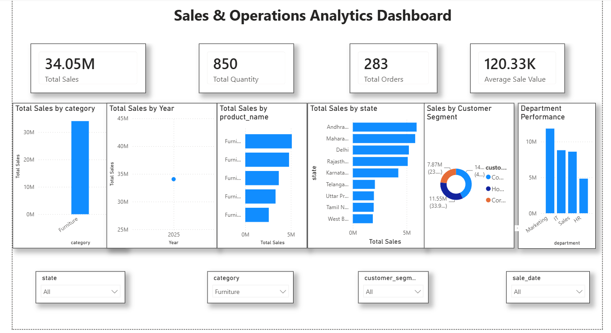
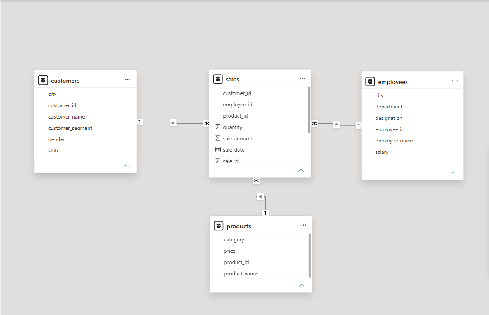
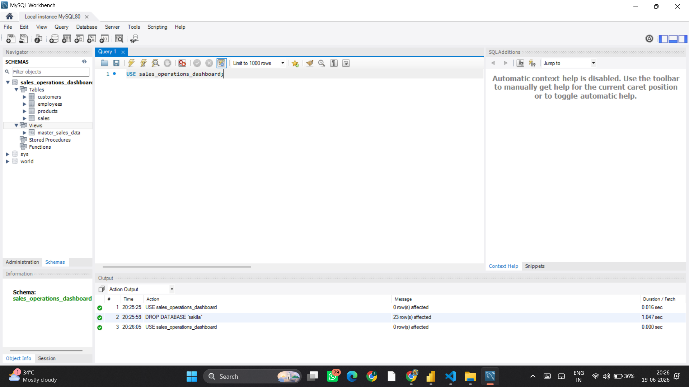

# 📊 Sales & Operations Analytics Dashboard

## 📌 Project Overview
The Sales & Operations Analytics Dashboard is an end-to-end Business Intelligence project developed using MySQL and Power BI. The project analyzes sales, customer behavior, product performance, employee contributions, and geographical trends through interactive dashboards and KPI visualizations.

The objective of this project is to transform raw transactional data into meaningful business insights that support data-driven decision-making.

---

## 🚀 Technologies Used

- MySQL 8.0
- MySQL Workbench
- Power BI Desktop
- DAX (Data Analysis Expressions)
- CSV Datasets
- Star Schema Data Modeling

---

## 📂 Project Structure

```
Sales_Operations_Analytics_Dashboard/
│
├── Assets/
│   ├── customers.csv
│   ├── products.csv
│   ├── employees.csv
│   └── sales.csv
│
├── PowerBI/
│   └── Sales_Operations_Analytics_Dashboard.pbix
│
├── SQL/
│   └── sales_operations_dashboard.sql
│
├── Screenshots/
│   ├── dashboard.png
│   ├── relationships.png
│   └── mysql_tables.png
│
└── README.md
```

---

## 🗄️ Database Design

### Tables

1. Customers
2. Products
3. Employees
4. Sales

### View

- master_sales_data

The project follows a relational database design where:

- One Customer → Many Sales
- One Product → Many Sales
- One Employee → Many Sales

---

## ⭐ Power BI Data Model (Star Schema)

- Fact Table:
  - Sales

- Dimension Tables:
  - Customers
  - Products
  - Employees

Relationships:

```
Customers (1) ------ (*) Sales
Products  (1) ------ (*) Sales
Employees (1) ------ (*) Sales
```

---

## 📈 KPIs Created

### Total Sales

```DAX
Total Sales = SUM(sales[sale_amount])
```

### Total Quantity

```DAX
Total Quantity = SUM(sales[quantity])
```

### Total Orders

```DAX
Total Orders = COUNT(sales[sale_id])
```

### Average Sale Value

```DAX
Average Sale Value =
DIVIDE([Total Sales],[Total Orders])
```

---

## 📊 Dashboard Features

### KPI Cards
- Total Sales
- Total Quantity Sold
- Total Orders
- Average Sale Value

### Visualizations
- Sales by Category
- Sales by Year
- Top Products Analysis
- State-wise Sales
- Customer Segment Analysis
- Department Performance

### Interactive Slicers
- State
- Category
- Customer Segment
- Sale Date

---

## 🔍 Business Analytics Queries

- Total Sales
- Total Orders
- Total Quantity Sold
- Average Sale Value
- Top 5 Products
- Sales by Category
- State-wise Sales
- Customer Segment Analysis
- Department Performance
- Monthly Sales Trend

---

## 📸 Dashboard Screenshots

### Final Dashboard



### Power BI Relationships



### MySQL Database Structure



---

## 💡 Key Insights Generated

- Identified top-performing product categories.
- Analyzed state-wise revenue contribution.
- Evaluated employee department performance.
- Studied customer segmentation trends.
- Built interactive dashboards for business decision-making.

---

## 🎯 Learning Outcomes

Through this project, I learned:

- Database Design using MySQL
- SQL Joins and Views
- Business Analytics Queries
- Power BI Dashboard Development
- DAX Measures
- Star Schema Modeling
- Data Visualization and Storytelling

---

## 👨‍💻 Author

**Your Name**

B.Tech CSE Student  
Aspiring Data Analyst | Business Intelligence Enthusiast | Full Stack Developer

---

## ⭐ If you found this project useful, feel free to star the repository.